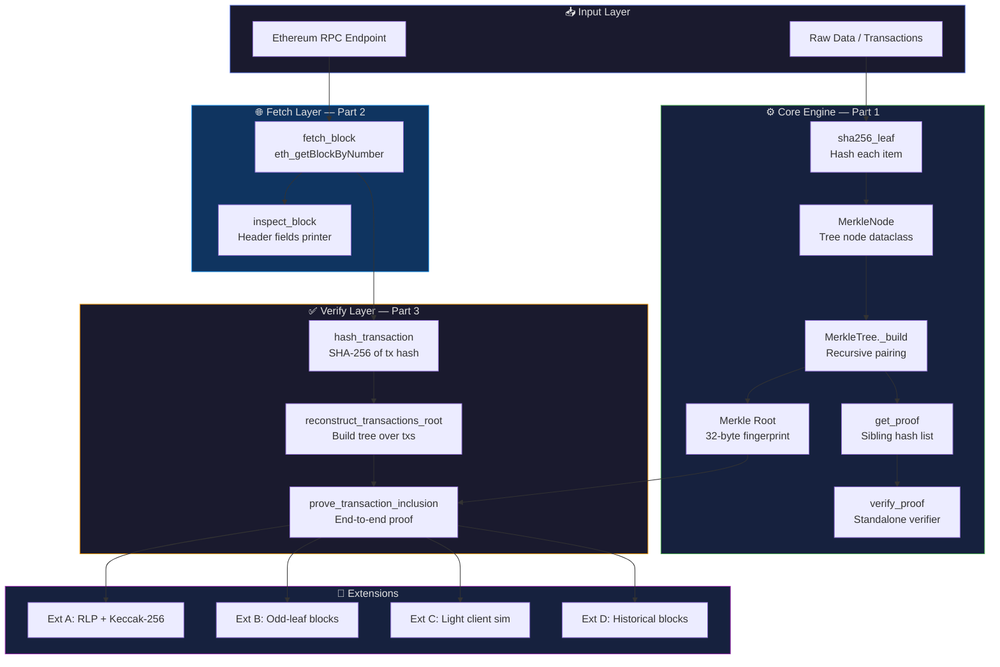
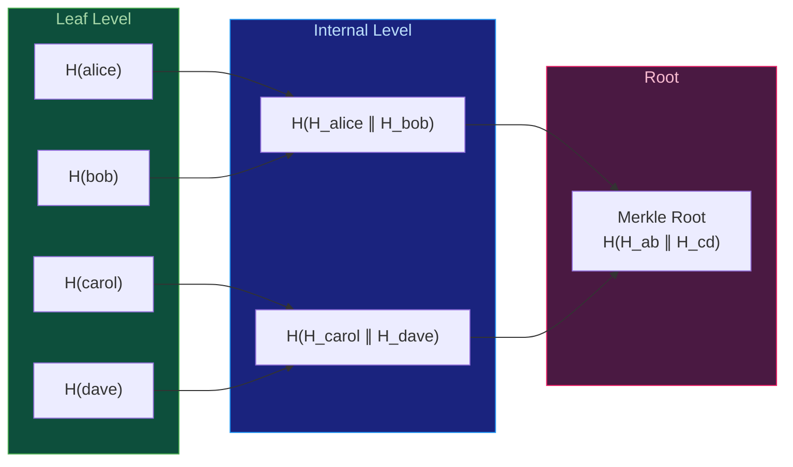
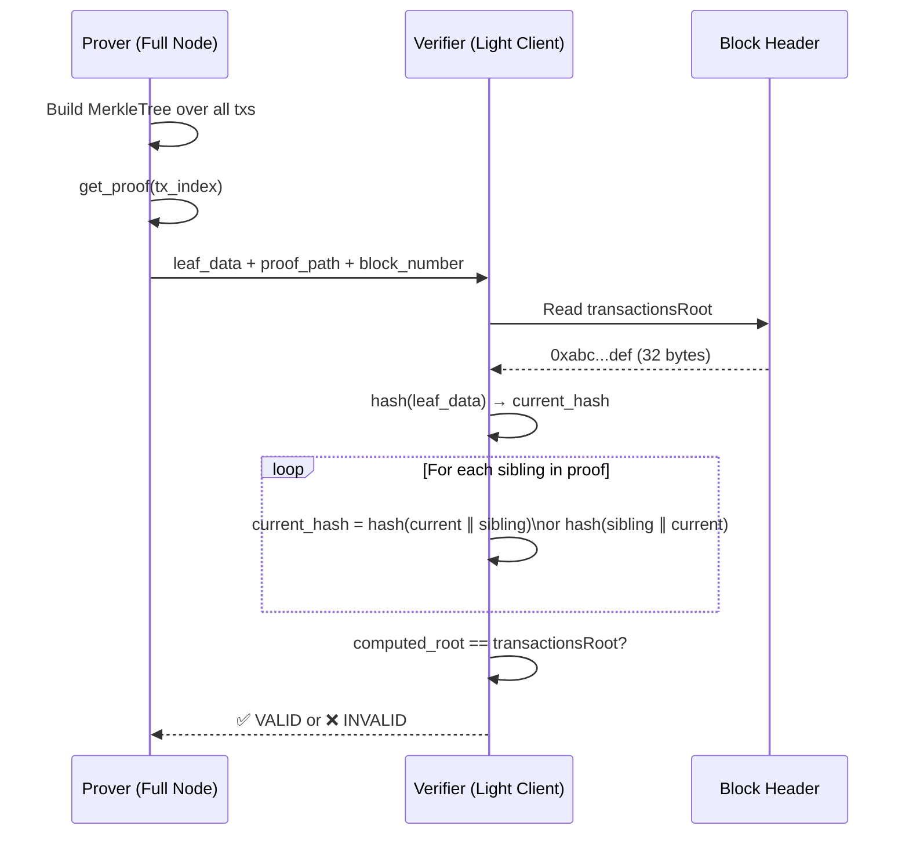
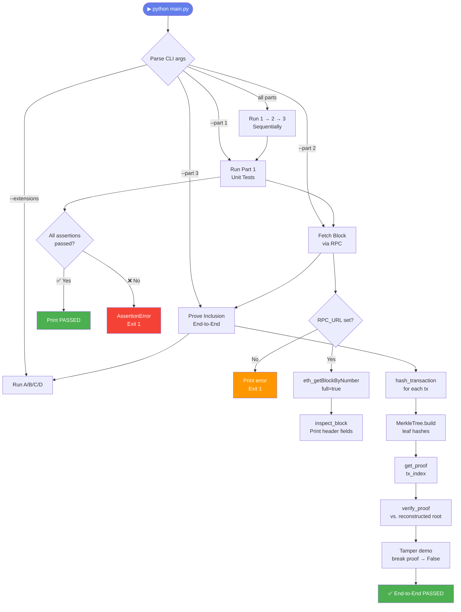

# 🔗 Ethereum Merkle Tree Verifier

<div align="center">


**A production-grade Python implementation of a binary Merkle Tree for verifying real Ethereum transactions — built from scratch using cryptographic hashing, live JSON-RPC block fetching, and end-to-end inclusion proof verification.**

[Overview](#-overview) • [Architecture](#-architecture) • [Quick Start](#-quick-start) • [How It Works](#-how-it-works) • [Testing](#-testing) • [Extensions](#-extension-challenges)

</div>

---

## 📖 Overview

Every Ethereum block header contains a single 32-byte value — the **`transactionsRoot`** — that is a cryptographic fingerprint of every transaction in the block. This project builds the data structure that generates and verifies that fingerprint: a **binary Merkle Tree**.

| Part | Module | Description |
|------|--------|-------------|
| **Part 1** | `src/part1_tree.py` | Pure-Python `MerkleTree` class, proof generation, standalone verifier |
| **Part 2** | `src/part2_fetch.py` | Fetches real Ethereum blocks via JSON-RPC (Alchemy / Infura) |
| **Part 3** | `src/part3_verify.py` | Reconstructs transactions root, generates & verifies inclusion proofs |
| **Extensions** | `src/extensions.py` | RLP+Keccak-256, odd-leaf detection, light client simulation, historical blocks |

---

## 🏗 Architecture

### System Overview



### Merkle Tree Construction Flow



### Proof Verification Flow



### Execution Flow (main.py)



---

## 🗂 Project Structure

```
ethereum-merkle-tree/
├── src/
│   ├── __init__.py
│   ├── part1_tree.py       # MerkleNode, MerkleTree, verify_proof()
│   ├── part2_fetch.py      # fetch_block(), inspect_block(), RPC helpers
│   ├── part3_verify.py     # hash_transaction(), prove_transaction_inclusion()
│   └── extensions.py       # Extension A (RLP+Keccak), B, C, D
├── tests/
│   ├── __init__.py
│   └── test_merkle.py      # Full pytest suite (50+ tests, 100% offline)
├── main.py                 # CLI entry point — orchestrates all parts
├── requirements.txt        # Pinned Python dependencies
├── Dockerfile              # python:3.11-slim container
├── docker-compose.yml      # Services: app + tests
├── .env.example            # Environment variable template
├── README.md
├── architecture.md
└── projectdocumentation.md
```

---

## ⚙️ Prerequisites

| Requirement | Version | Notes |
|-------------|---------|-------|
| Python | 3.11+ | Uses `list[type]` syntax |
| Docker + Compose | Any recent | For containerized execution |
| Ethereum RPC URL | — | Free tier from Alchemy or Infura |

---

## 🚀 Quick Start

### 1 — Clone & Configure

```bash
git clone https://github.com/ramalokeshreddyp/ethereum-merkle-tree.git
cd ethereum-merkle-tree

# Copy env template and add your RPC URL
cp .env.example .env
# Edit .env:  RPC_URL=https://eth-mainnet.g.alchemy.com/v2/YOUR_KEY
```

### 2 — Local Setup (without Docker)

```bash
# Create virtual environment
python -m venv .venv

# Activate — Windows
.venv\Scripts\activate
# Activate — macOS/Linux
source .venv/bin/activate

# Install dependencies
pip install -r requirements.txt

# Run Part 1 only (no network required)
python main.py --part 1

# Run all parts (requires RPC_URL in .env)
python main.py

# Run a specific block and transaction index
python main.py --part 3 --block latest --tx-index 0

# Run extension challenges
python main.py --extensions a b c d
```

### 3 — Docker (recommended)

```bash
# Build image and run all parts
docker compose up --build

# Run only the test suite
docker compose run tests

# Run specific parts interactively
docker compose run app python main.py --part 1
docker compose run app python main.py --extensions a c
```

---

## 🔬 How It Works

### Step 1 — Leaf Hashing

Each raw data item (or transaction hash) is SHA-256 hashed to form a leaf:

```python
leaf_hash = hashlib.sha256(data).digest()  # 32 bytes
```

### Step 2 — Tree Construction (bottom-up)

```
Leaves:    [H(alice)   H(bob)    H(carol)   H(dave)]
                  ↘ ↙                    ↘ ↙
Level 1:   [H(H_alice‖H_bob)    H(H_carol‖H_dave)]
                         ↘         ↙
Root:              [H(H_ab ‖ H_cd)]
```

- **Odd leaves** → last leaf is **duplicated** before pairing (standard convention)
- Recursion terminates when a single root node remains

### Step 3 — Proof Generation

For leaf at index `i`, the proof is the ordered list of **sibling hashes** from leaf level up to just below the root:

```python
proof = tree.get_proof(2)
# → [{"hash": b"...", "position": "left"}, {"hash": b"...", "position": "right"}]
```

### Step 4 — Standalone Verification

No tree access needed — only the leaf data, proof, and expected root:

```python
assert verify_proof(b"carol", proof, tree.root)       # True  ✅
assert not verify_proof(b"mallory", proof, tree.root)  # False ❌
```

### Transaction Hashing (Option A — Simplified)

```python
leaf = sha256(tx["hash"].encode("utf-8"))
# sha256_leaf() then hashes again internally
```

> **Note:** Ethereum's actual `transactionsRoot` uses **RLP encoding + Keccak-256 + Merkle Patricia Trie**. Option A validates the tree logic; see Extension A for the exact approach.

---

## 🧪 Testing

```bash
# Run the full test suite (offline, no RPC needed)
pytest tests/ -v

# With coverage report
pytest tests/ -v --cov=src --cov-report=term-missing

# Run a specific test class
pytest tests/test_merkle.py::TestVerifyProof -v

# Docker
docker compose run tests
```

### Test Coverage Summary

| Test Class | What is covered |
|------------|----------------|
| `TestMerkleTreeConstruction` | Build 1/2/3/4/5/100-leaf trees, empty raises `ValueError` |
| `TestMerkleRoot` | 32-byte output, determinism, manual root verification |
| `TestProofGeneration` | Structure, ordering, `left`/`right` positions, out-of-range |
| `TestVerifyProof` | Valid → True, tampered leaf → False, tampered proof → False |
| `TestHashTransaction` | Returns 32 bytes, deterministic, handles missing fields |
| `TestReconstructTransactionsRoot` | Matches manual build, empty raises, determinism |
| `TestSha256Pair` | Order matters, 32-byte output, manual SHA-256 check |

---

## 🔑 Environment Variables

| Variable | Required | Description |
|----------|----------|-------------|
| `RPC_URL` | ✅ Parts 2 & 3 | Ethereum JSON-RPC endpoint URL |

**Free RPC Providers:**

| Provider | URL Pattern |
|----------|-------------|
| Alchemy | `https://eth-mainnet.g.alchemy.com/v2/YOUR_KEY` |
| Infura | `https://mainnet.infura.io/v3/YOUR_PROJECT_ID` |
| Cloudflare (public) | `https://cloudflare-eth.com` |

---

## 🧩 Extension Challenges

| Extension | Description | CLI Flag |
|-----------|-------------|----------|
| **A — RLP + Keccak-256** | Accurate Ethereum leaf hashing using `rlp` + `pycryptodome` | `--extensions a` |
| **B — Odd-Leaf Detection** | Finds a block with odd tx count; proves odd-leaf duplication logic | `--extensions b` |
| **C — Light Client Sim** | Verifies inclusion using only the block header + proof (no full block) | `--extensions c` |
| **D — Historical Block** | Fetches a block from ~6 months ago; verifies a transaction in history | `--extensions d` |

```bash
# Run all four extensions
python main.py --extensions a b c d
```

---

## 📐 CLI Reference

```
usage: main.py [-h] [--part {1,2,3}] [--block BLOCK]
               [--tx-index TX_INDEX] [--extensions EXT [EXT ...]]

options:
  -h, --help              show this help message and exit
  --part {1,2,3}          Run only one part (default: all)
  --block BLOCK           Block number or 'latest' (default: latest)
  --tx-index TX_INDEX     Transaction index for proof (default: 0)
  --extensions a b c d    Extension challenges to run
```

---

## 📦 Dependencies

| Package | Version | Purpose |
|---------|---------|---------|
| `requests` | 2.32.3 | JSON-RPC HTTP calls to Ethereum node |
| `python-dotenv` | 1.0.1 | Load `.env` configuration |
| `rlp` | 4.0.1 | RLP encoding (Extension A) |
| `pycryptodome` | 3.21.0 | Keccak-256 hash (Extension A, Windows-compatible) |
| `pytest` | 8.3.5 | Test runner |
| `pytest-cov` | 5.0.0 | Test coverage reporting |

---

## 🔑 Key Concepts

| Concept | Explanation |
|---------|-------------|
| **Leaf node** | `sha256(raw_data)` — bottom of the tree |
| **Internal node** | `sha256(left_hash ‖ right_hash)` |
| **Merkle root** | Single 32-byte cryptographic fingerprint |
| **Merkle proof** | ~log₂(n) sibling hashes — logarithmic space |
| **transactionsRoot** | Ethereum block header field committing all transactions |
| **RLP** | Recursive Length Prefix — Ethereum's binary serialisation format |
| **Keccak-256** | Ethereum's hash function (≠ SHA3-256 / SHA-256) |
| **MPT** | Merkle Patricia Trie — Ethereum's actual trie structure |

---

## 🔒 Security Notes

- **No private keys, wallets, or signing** — all operations are read-only
- **No gas spent** — only `eth_getBlockByNumber` / `eth_getTransactionByHash` RPC calls
- `.env` is `.gitignore`d — never commit your API key
- RLP + Keccak hashing done with `pycryptodome` (not `pysha3`) for Windows compatibility

---

## 🧠 Key Takeaway

> The `transactionsRoot` in every Ethereum block header is a **cryptographic commitment** — a single 32-byte value that locks in every transaction in the block. Change any transaction and the root changes. Forge a root and the block's proof-of-stake signature becomes invalid.
>
> Your Merkle tree implementation is the **same data structure — conceptually — that secures billions of dollars of on-chain value.** The difference between your implementation and Ethereum's is encoding details and trie structure, not the underlying idea.

---

## 📄 License

MIT © 2025
