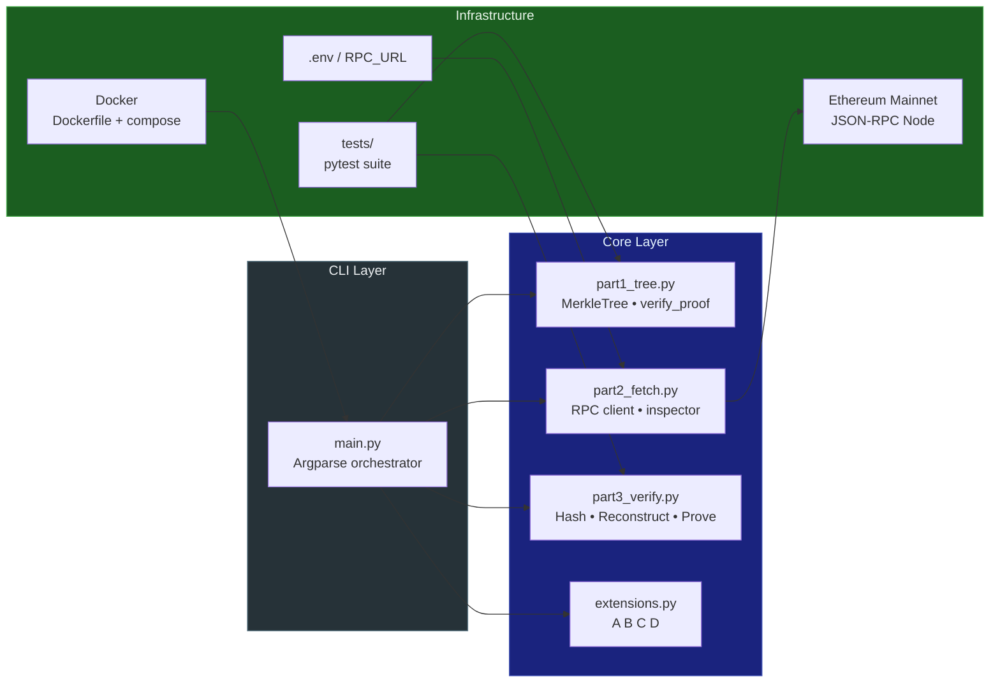
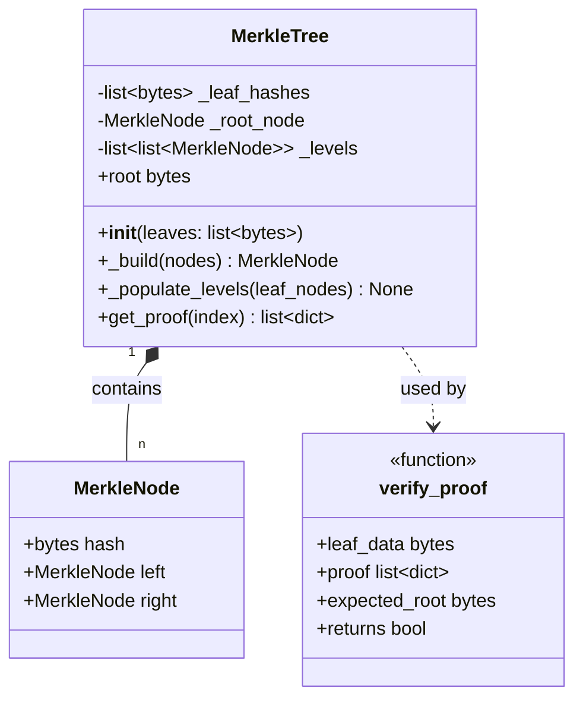
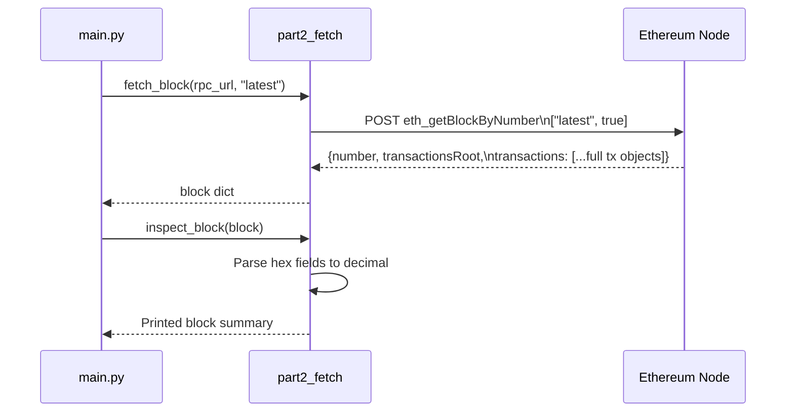
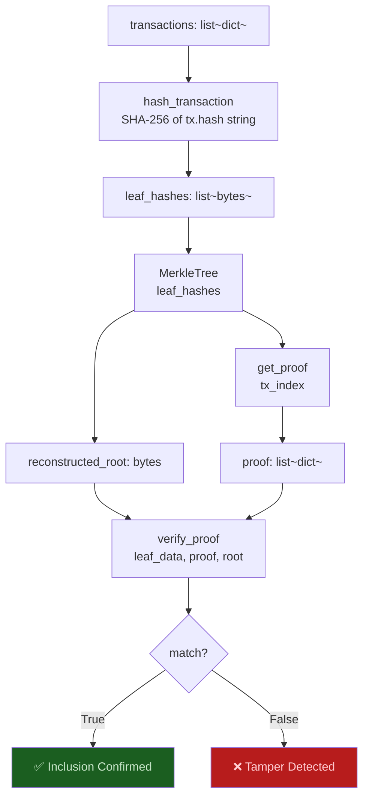
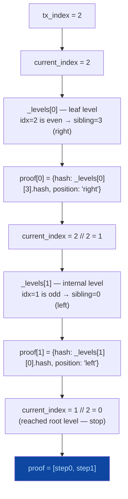
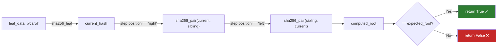
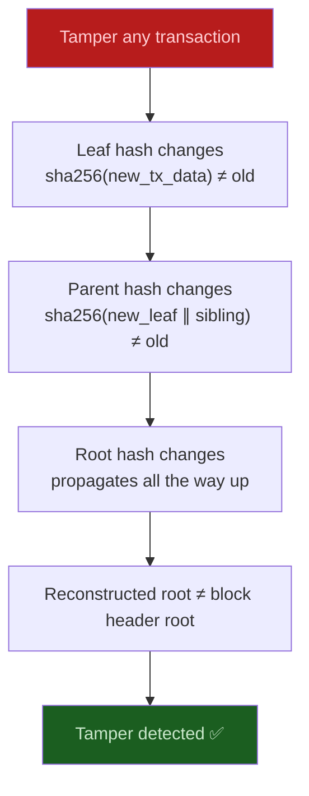
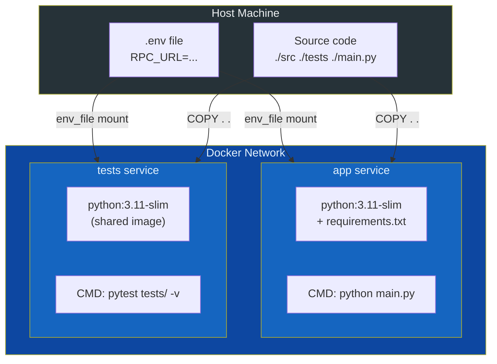
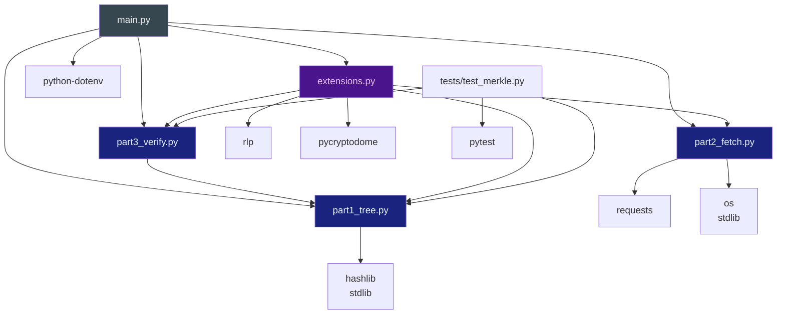

# Architecture — Ethereum Merkle Tree Verifier

## 1. System Overview

This project implements a **binary Merkle Tree** in Python to verify Ethereum transaction inclusion. The architecture is divided into three independently runnable parts plus an extensions layer, all orchestrated through a single CLI entry point.



---

## 2. Module Architecture

### 2.1 Part 1 — `src/part1_tree.py`

The foundational module. No external imports — uses only Python's `hashlib`.



**Key design decisions:**

| Decision | Rationale |
|----------|-----------|
| Separate `_build()` and `_populate_levels()` | `_build()` creates the root; `_levels[]` array enables O(log n) proof generation without tree traversal |
| Duplicate last leaf on odd count | Standard Bitcoin/Ethereum educational convention |
| `verify_proof` is standalone | Verifier should need no access to the full tree — mirrors real light client behaviour |
| Double hashing (`sha256_leaf` then `sha256_pair`) | Leaf domain separation prevents second pre-image attacks |

### 2.2 Part 2 — `src/part2_fetch.py`

JSON-RPC client for Ethereum Mainnet.



**Error handling strategy:**

- HTTP errors → `requests.HTTPError` (raised by `.raise_for_status()`)
- RPC-level errors → `ValueError` with code + message
- Missing block → `ValueError("Block not found")`
- Missing env var → `EnvironmentError` with setup instructions

### 2.3 Part 3 — `src/part3_verify.py`

Bridges Parts 1 and 2. Hashes transactions → builds tree → generates + verifies proofs.



### 2.4 Extensions — `src/extensions.py`

| Extension | Key Function | Dependencies |
|-----------|-------------|--------------|
| **A — RLP + Keccak** | `hash_transaction_keccak(tx)` | `rlp`, `pycryptodome` |
| **B — Odd Leaf** | `find_odd_tx_block(rpc_url)` | `part2_fetch` |
| **C — Light Client** | `light_client_verify(header, idx, proof, leaf)` | `part1_tree` |
| **D — Historical** | `run_extension_d(rpc_url)` | `part2_fetch`, `part3_verify` |

---

## 3. Data Flow

### 3.1 Tree Construction Data Flow

```mermaid
flowchart LR
    RAW["Raw bytes\nb'alice', b'bob'..."] -->|sha256_leaf| LEAF["Leaf hashes\n32 bytes each"]
    LEAF -->|Pair & hash| L1["Level 1 hashes"]
    L1 -->|Pair & hash| L2["Level 2 hashes"]
    L2 -->|...| ROOT["Merkle Root\n32 bytes"]

    LEAF -->|stored in _levels[0]| LVLS["_levels array\n[leaves, L1, L2, ..., root]"]
    L1 -->|stored in _levels[1]| LVLS
    ROOT -->|stored in _root_node| RN["_root_node\nMerkleNode"]

    style ROOT fill:#4a148c,color:#e1bee7
    style RN fill:#4a148c,color:#e1bee7
```

### 3.2 Proof Generation Data Flow



### 3.3 Proof Verification Data Flow



---

## 4. Cryptographic Design

### Hash Function Selection

| Layer | Hash Function | Why |
|-------|--------------|-----|
| Leaf hashing | SHA-256 (hashlib) | Standard library, deterministic, collision-resistant |
| Internal nodes | SHA-256 of concatenation | Binds children together cryptographically |
| Extension A leaves | Keccak-256 of RLP bytes | Matches Ethereum's actual leaf computation |

### Tamper Evidence Properties



### Odd-Leaf Duplication

```
3 leaves: [H_a, H_b, H_c]
          └ duplicate last → [H_a, H_b, H_c, H_c]
          → pair: [H(H_a‖H_b), H(H_c‖H_c)]
          → root: H(H_ab ‖ H_cc)
```

This convention is applied consistently at every level of the tree during both build and proof generation.

---

## 5. Container Architecture



**Dockerfile layers (optimised for cache):**

```
python:3.11-slim
└── RUN apt-get gcc python3-dev        # system deps for pycryptodome
└── COPY requirements.txt              # cached separately
└── RUN pip install -r requirements.txt
└── COPY . .                           # source last (most volatile)
└── CMD ["python", "main.py"]
```

---

## 6. Dependency Graph



---

## 7. Error Handling Architecture

| Layer | Error Type | Handler |
|-------|-----------|---------|
| RPC HTTP | `requests.HTTPError` | Re-raised from `_rpc_call()` |
| RPC logic | `ValueError` | Raised with code + message |
| Missing block | `ValueError` | "Block not found" |
| Empty tree | `ValueError` | "Cannot build from empty list" |
| Bad proof index | `IndexError` | "Leaf index out of range" |
| Missing RPC_URL | `EnvironmentError` | Printed with setup steps, `sys.exit(1)` |
| Extension A import | `ImportError` | Caught, prints `[SKIP]` message |

---

## 8. Scalability Considerations

| Factor | Current Approach | Production Approach |
|--------|-----------------|-------------------|
| Proof size | O(log₂ n) hashes | Same — this is optimal |
| Tree build | O(n) memory for all levels | Could stream, store only current + previous level |
| RPC calls | Single `eth_getBlockByNumber` | Retry logic + backoff for production |
| Transaction hashing | SHA-256 of tx hash string | Full RLP + Keccak-256 (Extension A) |
| Trie structure | Plain binary tree | Merkle Patricia Trie (Ethereum actual) |

---

## 9. Why Not a Merkle Patricia Trie?

Ethereum's actual `transactionsRoot` is computed using a **Merkle Patricia Trie** (MPT), not a plain binary tree:

| Aspect | Plain Binary Tree (this project) | Merkle Patricia Trie (Ethereum) |
|--------|----------------------------------|--------------------------------|
| Indexing | Position-based (index 0, 1, 2…) | Key-value (RLP-encoded index as key) |
| Proof type | List of sibling hashes | List of trie nodes along path |
| Match block header? | ❌ No | ✅ Yes |
| Conceptual clarity | ✅ High | ⚠️ Complex |
| Purpose here | Build core intuition | Production blockchain use |

This project implements the plain binary tree to build solid intuition of the core concept. Extension A brings the leaf hashing closer to Ethereum's actual computation.
